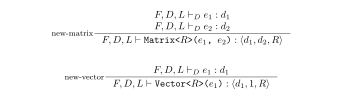
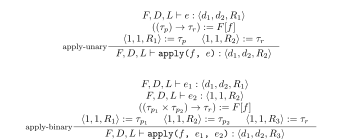
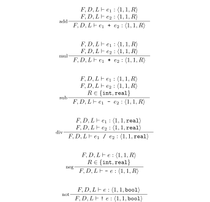
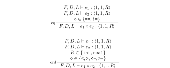

# Type System
We define the GraphAlg type system formally using [typing rules](https://en.wikipedia.org/wiki/Typing_rule).

## Notation

### Environments
Typing rules use three distinct environments:
- Function environment $$F$$: Associates function names with the parameter and results types of those functions.
- Dimension environment $D$: Associates variable names with dimension symbols.
- Local environment $L$: Associates variable names with a matrix type.

The environment objects have map semantics:
- $M \in L$ asserts that $L$ contains a value for $M$.
- $L[M]$ retrieves the value for key $M$ from environment $L$.
  Implies $M \in L$.
- $L' := L[M := \tau]$ creates an updated environment $L'$ that contains all mappings from $L$ plus a mapping from $M$ to $\tau$.
  If $M \in L$, then the original value for $M$ is dropped ($L'[M] = \tau$).

### Type Instances
Type instances are denoted $\langle d_1, d_2, R \rangle$, where
- $d_1$ is the dimension symbol for the number of rows
- $d_2$ is the dimension symbol for the number of columns
- $R$ is the semiring

### Bindings
We use the syntax $A := B$ to bind the value of $B$ to a new variable $A$.
This binding syntax is also used to destructure types, e.g. $\langle d_1, d_2, R \rangle := \tau$ allows referencing the dimension symbols and the semiring of $\tau$. Furthermore, the syntax can also be used for asserting (partial) matches. For example, the statement $\langle d, 1, R_1 \rangle = \tau_1$ following by $\langle 1, d, R_2 \rangle$ asserts that:
- $\tau_1$ has one column
- $\tau_2$ has one row
- The number of rows in $\tau_1$ matches the number of columns in $\tau_2$

No requirement is placed on the relation of $R_1$ and $R_2$: they may refer to the same semirings, or to two different ones.

## Functions
Functions have a function type of the form $(\tau_1 \times \tau_2) \rightarrow \tau_r$.
A program is nothing more than a collection of functions.
Note that the order in which functions are defined is significant:
A function cannot be referenced before they are defined.

## Statements
Statements update the $D$ and $L$ environments.
They do not have a type of their own.

### Assign
If there is no existing binding for the variable to be assigned, the first rule applies.
Otherwise, the more involved reassignment rule applies.

Complementing the mask does not influence the typing in any way.
It is omitted from the typing rule for simplicity.

The following additional typing rules deal with updating dimension symbol context $D$ if the expression to be assigned represents a dimension. It also defines the semantics of $\vdash_D$ to infer the dimension represented by an expression.

### Accumulate
The variable to accumulate into must be defined.
The expression to accumulate must have the same type.

### For
We give one rule for loops with an integer bound (start and end), and another for loops over a dimension symbol.

Additional variables defined inside the loop scope are not available outside that scope, except for in the `until` expression.

## Expressions
Well-typed expressions have an associated matrix type $\tau$ as determined by the following rules.

### Variable
Variables must be defined before they are referenced.

### Matrix Multiply
Matrix multiplication requires that the number of columns on the left-hand side matches the number of rows on the right-hand side.

### New Matrix/Vector
Arguments to matrix/vector creation must refer to dimension symbols.

### Transpose
Transpose is valid for any input matrix.

### `diag`
`diag` requires the input to be either a row or a column vector.

### `apply`
Functions used in `apply` must be defined over scalar input and output types.
The parameter semirings must match those of the respective input arguments.

### `select`
The typing is similar to `apply`, but the result of `f` should be a boolean.

### `reduce`
All variants of `reduce` are valid for any input matrix.

### `pickAny`
`pickAny` does not change the type of the input matrix.

### Element-wise Operations
Input types for the left and right-hand sides must match, except for function application.

### Cast
All conversions between semirings are allowed.

### Matrix Properties (`nrows`, `ncols`, `nvals`)
All matrix properties return an integer.

### Scalar Arithmetic
Arithmetic operations are defined for scalar (1 by 1) inputs.
Operations such as subtraction or division are only allowed on specific semirings.

### Scalar Compare
Ordered comparison operations are only allowed on the `int` and `real` semirings.
Equality comparison is allowed regardless of the semiring.

### Literal
Literals must be valid for the specified semiring.

